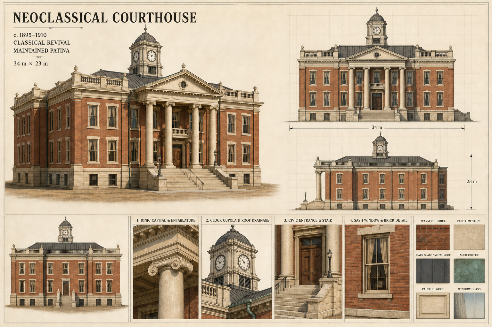

# Civic Hall — concept v1

Status: **Revision requested — retained for comparison**

## Design lock proposed by this sheet

- Late nineteenth-century county courthouse and town hall.
- Approximate footprint: 34 m wide by 23 m deep.
- Two principal storeys over a raised, strongly expressed limestone foundation.
- Symmetrical warm-red-brick body with a central four-column portico and broad civic stair.
- Pale limestone trim, restrained parapet balustrade, dark hipped metal/slate roof, and centred clock cupola.
- Tall sash windows use subtle glazing, curtains, and shallow dark interior cards.
- Maintained patina: gentle brick variation, faint limestone streaking, aged copper drainage, and light stair-edge wear.

## Modeling interpretation after approval

The orthographic views define the main proportions. The beauty view governs silhouette, material hierarchy, and visual character. Detail panels govern the column rhythm, entrance construction, cupola, roof drainage, window depth, and masonry treatment. Small inconsistencies typical of a concept sheet will be resolved into historically plausible, repeatable construction during scripted modeling without changing the approved identity.

No modeling has begun. Approval of this sheet authorizes the first Blender script and does not constitute final-asset approval.

## Generation record

- Mode: new image generation
- Output: 1536 × 1024 PNG
- Intent: original architectural concept and modeling reference; no specific real property was copied.
