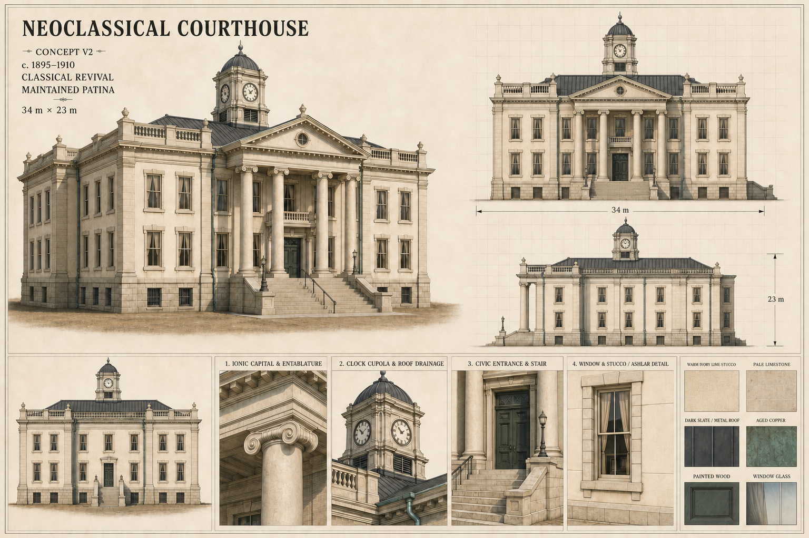

# Civic Hall — concept v2

Status: **Concept approved — 6 August 2026**

## Design lock proposed by this sheet

- Early twentieth-century civic hall and town hall.
- Approximate footprint: 34 m wide by 23 m deep.
- Two principal storeys over a raised, strongly expressed limestone foundation.
- Warm ivory mineral lime stucco over masonry replaces all exposed brick.
- Pale honey-grey limestone defines the stair, entablature, cornices, window surrounds, balustrade, quoins, and foundation.
- Select wall fields use restrained ashlar scoring to establish civic scale without imitating brick.
- A dark hipped metal/slate roof, aged-copper drainage, green-grey civic doors, and centred clock cupola give the pale building contrast.
- Tall sash windows use subtle glazing, cream curtains, and shallow dark interior cards.
- Maintained patina: faint mineral streaks, gentle foundation discoloration, restrained copper oxidation, and light stair-edge wear.

## Modeling interpretation after approval

Concept v2 retains the massing and construction logic of v1 while establishing a clear civic material identity. The orthographic views define the main proportions. The beauty view governs silhouette, value hierarchy, and visual character. Detail panels govern the entrance construction, cupola, roof drainage, window depth, ashlar scoring, and mineral finish.

This sheet is the approved modeling reference. Final-asset approval remains a separate gate.

## Generation record

- Mode: image edit of concept v1
- Output: 1536 × 1024 PNG
- Final prompt: preserve the original, internally consistent civic-hall presentation sheet and 34 m × 23 m massing; replace every exposed brick surface with warm ivory mineral lime stucco and pale honey-grey limestone; retain a dark roof, restrained aged copper, green-grey doors, windows with shallow interior depth, and cared-for age; update all elevations, detail callouts, and palette swatches consistently; keep the result original, modelable, and free of modern or identifying elements.
