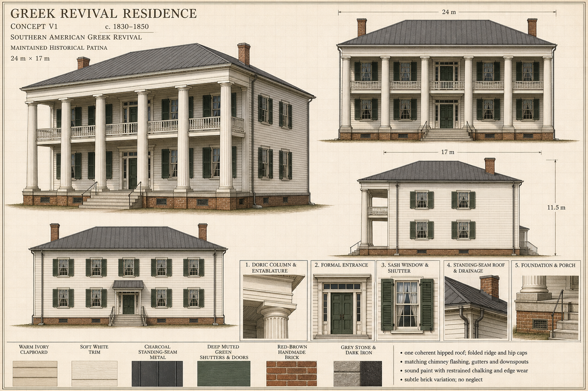

# Greek Revival Residence — concept v1

Status: **Concept approved — 7 August 2026**

## Design lock proposed by this sheet

- Circa 1830–1850 Southern American Greek Revival residence with maintained historical patina.
- Approximate roof-edge footprint: 24 m wide by 17 m deep, including the deep front gallery; approximately 11.5 m to the main roof ridge.
- Symmetrical five-bay, two-storey timber-frame main block over a raised brick foundation.
- Full-width, full-height colonnade of six painted timber Greek Doric columns supports a continuous plain entablature and the front eave.
- A restrained upper gallery railing, broad stone entrance steps, and balanced front and rear elevations preserve the residence's quiet domestic scale.
- Warm ivory painted clapboard, soft white trim, deep muted green shutters and doors, red-brown handmade brick, grey stone, and dark iron establish the collection palette.
- Six-over-six sash windows use subtle glass, off-white curtains, and shallow dark interior cards; louvered shutters include hinges, pintles, and holdbacks.
- The formal central entrance uses paired paneled doors, a rectangular multi-light transom, narrow sidelights, plain pilasters, a heavy lintel, and dark iron hardware.
- One low-pitched hipped standing-seam roof covers the main block and deep gallery. Two interior brick chimneys receive matching counterflashing; folded ridge and hip caps, half-round gutters, strapped downspouts, and splash blocks form one coherent drainage system.
- The raised foundation includes a grey stone water table, warm red-brown brickwork, recessed ventilation grilles, porch-edge and joist logic, stone steps, and restrained iron rails.
- Maintained aging is limited to gentle paint chalking, light edge wear, subtle brick variation, dulled roof metal, and faint rain shadows—never neglect or generalized dirt.

## Modeling interpretation after approval

The orthographic views define the main proportions, five-bay organization, six-column rhythm, gallery depth, window spacing, chimney positions, and roof silhouette. The beauty view governs material hierarchy and architectural character. Detail panels govern the Doric order, entrance, layered window depth, shutter hardware, standing-seam roof and drainage assembly, and the foundation-to-porch relationship.

Small inconsistencies typical of a generated concept sheet will be resolved into historically plausible, repeatable construction during scripted modeling without changing the approved identity. Roof planes, seams, ridge and hip caps, chimney flashing, gutters, downspouts, and their supports will be modeled as a continuous system visible from every angle.

This sheet is the approved modeling reference. Final-asset approval remains a separate gate.

## Generation record

- Mode: built-in new image generation
- Output: 1536 × 1024 PNG
- Final prompt: create an original, internally consistent circa 1830–1850 Southern American Greek Revival residence concept sheet with a 24 m × 17 m five-bay timber body, six-column full-height Doric gallery, coherent hipped standing-seam roof and drainage, paired brick chimneys, formal entrance, layered sash-window depth, shutters and hardware, raised detailed foundation, matching beauty and orthographic views, five construction callouts, material swatches, dimensions, and maintained historical patina; exclude identifying names, specific-property imitation, modern elements, interiors, neglect, and structurally unexplained details.
