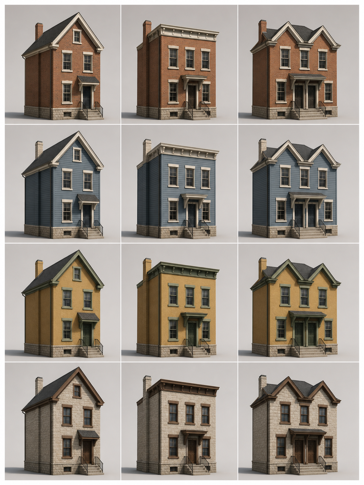

# Narrow-front Residence Set — concept v1

Status: **Concept approved — 8 August 2026**

## Design lock proposed by this sheet

- Compact exterior-only residential set for dense town streets.
- One shared package with a footprint family of approximately 8–10.4 m wide by 12 m deep.
- Three shape variants: Gable, Cornice, and Paired.
- Gable: narrow front gable, centered entry, small canopy, two full storeys and an attic volume.
- Cornice: taller flat-front form with a concealed roof edge, repeated upper windows, and a compact entry.
- Paired: wider two-entry residence with twin front-gable roof masses, a shared rear roof volume, and balanced side windows.
- Shared construction vocabulary: raised stone base, wall body, trim bands, sash-window cards, shallow glazing, entry doors, roof, chimneys, and restrained hardware.
- Four material palettes: Brick and cream, Painted blue, Ochre and green, and Stone and brown.
- Geometry variants share texture sets and semantic material names so one GLB can serve all combinations.
- Maintained age is limited to mild material variation and edge wear; no neglect, signage, interiors, or storefront logic.

## Runtime and review intent

The GLB will contain named `Shape_Gable`, `Shape_Cornice`, and `Shape_Paired` roots. The runtime clones only the selected root and applies a cached palette material set. The combined package target is below 120,000 triangles and 25 MB, with no more than 12 material slots on any selected shape.

The approved preview is the visual reference for the runtime package. The generated asset remains exterior-only and uses the same three shape roots and four palettes shown above.
