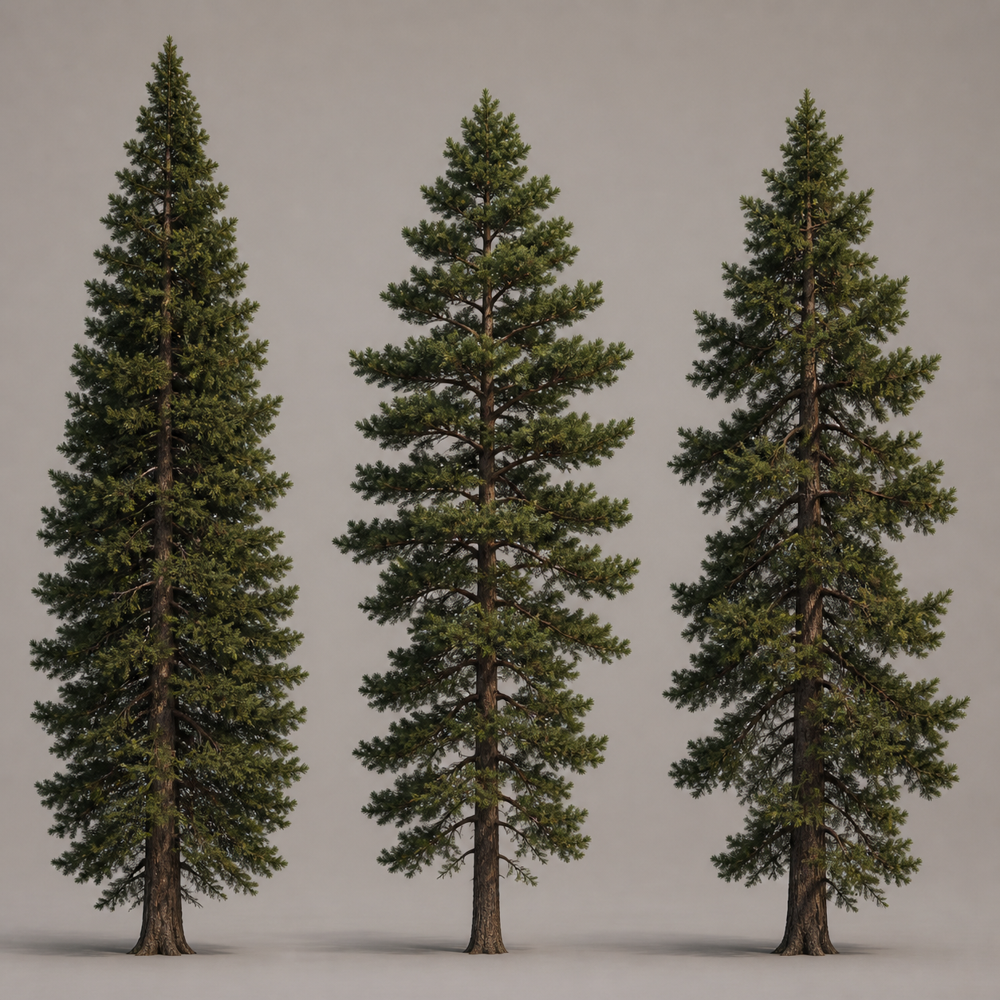

# Woodland Pine — Concept V1

## Intent

Woodland Pine is the first conifer in the runtime collection. It is a mature,
tall, tapered evergreen intended for general landscape placement rather than a
specific biome or season.

The production package contains three related silhouettes:

1. **Upright** — tall and balanced with a dense tapered crown.
2. **Open crown** — more widely spaced branch tiers with visible trunk structure.
3. **Asymmetric** — gently irregular branching that breaks up repetition without
   becoming a wind-bent or mountain-specific tree.

The shared runtime bounds are approximately 22 m high and 18 m across. The
asset origin is at the bottom centre of the trunk and all foliage remains above
the ground plane.

## Approval image

The concept sheet is a silhouette and realism reference, not a runtime texture.
The processed needle atlas is kept separately under `source/` for alpha-card
authoring. The current runtime revision uses `needle-atlas-v2.png` with dense,
overlapping branchlet clusters and `pine-impostor-atlas-v2.png` plus its matching
normal atlas. The catalogue thumbnail is rendered from that final impostor source
so it represents the runtime asset rather than a separate concept crop.

## Production constraints

- Deep evergreen needle clusters with muted variation.
- Brown, rough bark and visible branch structure.
- No snow, seasonal decoration, text, labels, watermark, or props.
- LOD0 retains branch and needle-card detail; LOD1 reduces both while keeping
  the characteristic tiered silhouette.
- Eight-view impostors and low-poly shadow proxies are generated for every
  variant.

## Runtime fidelity review

The canonical production source is `tools/blender/woodland_pine.py`. LOD0 uses
1,400 three-card needle clusters per variant and LOD1 uses 700 two-card clusters;
both retain the lower-wide, upper-tapered tier layout. The vegetation audit checks
the mesh contract, foliage density, alpha coverage, embedded color/normal images,
matching impostor transparency, material double-sidedness, and ground-centred
bounds.
